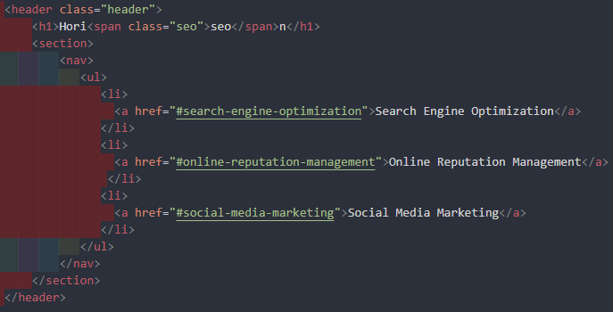
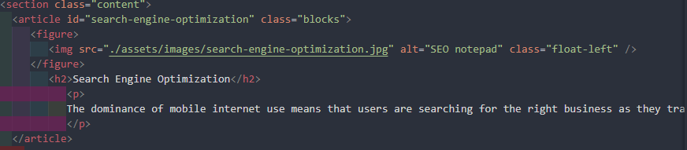
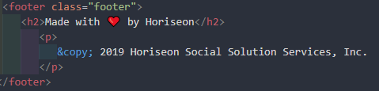

# Challenge-1
Code refactor

##Description
The webpage of Horiseon, a marketing agency, is a mock-up of a project that involved a very important part of web development - accessibility. The key point of this project is to follow accessability standarts to keep the website optimized for search engines. It contains HTML, CSS files, README file and Image folder to work with. The Horiseon webpage was the best practice to review and refactor the code in order to make the search and user accsess easier.Using semantic HTML elements and making CSS more efficient, created a new accessible code for the Horison webpage.

###Instalation
N/A

###Usage
In this project all the work was made in HTML file (index.html) and styled in CSS file (style.css). Working with HTML file basic div element were changed to semantic elements so that the site could be more responsive for search engines. A semantic element clearly describes its meaning to both the browser and the developer. This project's webpage contains such semantic elements:

*The HEADER with SECTION and navigation NAV elements inside

*main part with ARTICLE - independent, self-contained content and FIGURE to wrap images and ASIDE - an indirectly related content (a sidebar)

*The FOOTER defines the end of the document.

Accourding to that, the stylesheet needed some changes as well. Three 
 elements were changed into <section>. Some elements with the same properties for similar classes were united and organised as they appear in HTML. So the SCC file could become cleaner and more readable. Plus comments were added.

###Credits
N/A

###License
Please refer to the LICENSE in the repo.
  
  This project was deployed on GitHub pages: https://sashak2609.github.io/Challenge-1/
